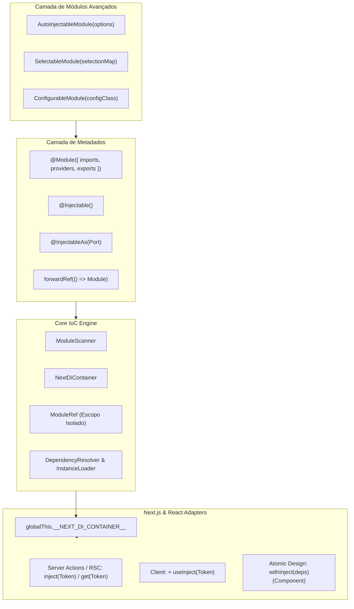
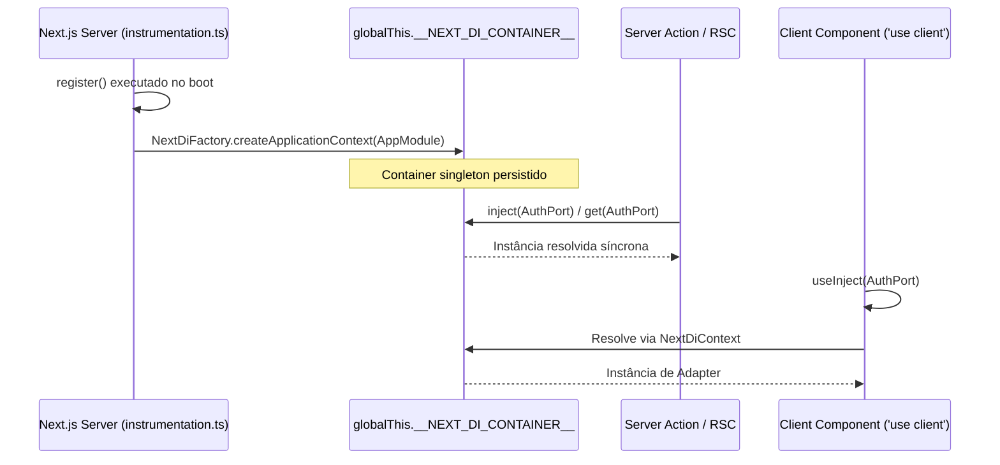

# Design: Sistema de Módulos (NestJS-like Modular Architecture)

## Architecture Overview

O sistema de módulos do `next-di` é estruturado em três camadas essenciais:



---

## 1. O Algoritmo de Resolução de Módulos e Isolamento de Escopo

### 1.1. Varredura e Criação do Grafo (`ModuleScanner`)

1. Inicia pelo módulo raiz (`AppModule`).
2. Lê metadados via `Reflect.getMetadata(MODULE_METADATA.IMPORTS, module)`.
3. Normaliza `DynamicModule` e referências encapsuladas em `forwardRef`.
4. Para cada módulo descoberto:
   - Cria uma instância de `ModuleRef(ModuleClass)`.
   - Registra no `NextDiContainer.modules`.
   - Varre recursivamente os módulos importados.
   - Registra módulos marcados com `global: true` no conjunto global do container.

### 1.2. Fronteira de Visibilidade de Provedores

Quando um componente em `ModuleA` solicita uma dependência com token `T`:

1. **Verificação Local**: O `ModuleRef(ModuleA)` procura `T` em sua tabela interna de `providers`. Se encontrar, resolve a instância.
2. **Verificação de Importados**: O `ModuleRef(ModuleA)` itera sobre seus `imports`:
   - Para cada `ModuleRef(ModuleB)` importado: verifica se `T` está explicitamente na coleção de `exports` de `ModuleB`.
   - Se estiver exportado, resolve através de `ModuleB`.
   - **Regra de Isolamento**: Se `T` estiver em `ModuleB.providers` mas NÃO em `ModuleB.exports`, o `ModuleA` NÃO tem permissão para vê-lo.
3. **Verificação Global**: Se não for encontrado localmente nem nos imports diretos, verifica os módulos registrados como `global: true` que exportam `T`.
4. **Falha de Resolução**: Se não encontrado em nenhum escopo válido, lança `UnknownProviderException(Token, ModuleA)`.

### 1.3. Ciclo de Resolução de Instâncias (Singletons)

- Instâncias de provedores são inicializadas de forma preguiçosa (lazy) ou antecipada durante o bootstrap da aplicação (`createApplicationContext`).
- O `InstanceLoader` constrói o grafo de dependências verificando os parâmetros do construtor via `Reflect.getMetadata('design:paramtypes', target)` e decorators `@Inject(token)` ou `@Optional()`.
- Ciclos são detectados: quando uma dependência circular é envolvida em `forwardRef`, uma referência em proxy ou resolução adiada em duas fases é utilizada.

---

## 2. Dynamic Modules e Fábricas Especializadas

### 2.1. `DynamicModule` Interface

```typescript
export interface DynamicModule {
  module: Type<any>;
  imports?: Array<Type<any> | DynamicModule | Promise<DynamicModule> | ForwardReference>;
  providers?: Provider[];
  exports?: Array<Type<any> | InjectionToken | DynamicModule | ForwardReference>;
  controllers?: Type<any>[];
  global?: boolean;
}
```

### 2.2. `AutoInjectableModule`

Elimina o boilerplate de declarar portas nos `providers` e `exports`:

1. Inspeciona cada provider na lista fornecida.
2. Extrai os metadados anotados por `@InjectableAs(PortClass)`.
3. Para cada porta encontrada:
   - Cria o binding `{ provide: PortClass, useExisting: ProviderClass }`.
   - Adiciona a porta à lista final de `exports`.
4. Retorna uma classe base de módulo já decorada com `@Module({ providers, exports, imports, controllers })`.

### 2.3. `SelectableModule`

Permite chaveamento seguro e tipado entre múltiplas implementações de módulos (ex: `mock` vs `fetch`):

1. Recebe um mapa estático `selectionMap: { mock: AuthMockModule, fetch: AuthFetchModule }`.
2. Expõe `forRootAsync(config: { provider: keyof selectionMap, useFactory, inject })`.
3. Valida em runtime se a chave do provedor existe no mapa.
4. Se o módulo selecionado implementar `forRootAsync` (como um `ConfigurableModule`), orquestra o repasse de configurações com injeção tipada de dependências.

### 2.4. `ConfigurableModule`

Base para módulos assíncronos dinâmicos orientados a configuração:

1. Recebe `configClass: Type<TConfig>`.
2. Gera o método estático `forRootAsync({ global, inject, useFactory })`.
3. Fornece o `configClass` via `useFactory` injetado e o exporta para que os serviços do módulo possam consumi-lo diretamente via construtor `constructor(private config: MyModuleConfig)`.

---

## 3. Integração com Next.js e React



### 3.1. `withNextDi` (Plugin Next.js)

- Modifica a configuração do compilador SWC/Turbopack para:
  - Ativar `experimentalDecorators: true`
  - Ativar `emitDecoratorMetadata: true`
- Injeta o entry point de bootstrap em `instrumentation.ts` caso o desenvolvedor utilize inicialização automática.

### 3.2. Persistência em `globalThis`

```typescript
const GLOBAL_KEY = Symbol.for('__NEXT_DI_CONTAINER__');

export function setGlobalContainer(container: NextDiApplicationContext): void {
  (globalThis as any)[GLOBAL_KEY] = container;
}

export function getGlobalContainer(): NextDiApplicationContext {
  const container = (globalThis as any)[GLOBAL_KEY];
  if (!container) {
    throw new Error(
      'NextDi container não foi inicializado. Certifique-se de executar o bootstrap no instrumentation.ts.'
    );
  }
  return container;
}
```

### 3.3. Funções de Injeção

- `inject(token)`: Lê `getGlobalContainer().get(token)` de maneira síncrona e idiomática (estilo Angular moderno).
- `useInject(token)`: Lê a partir do React Context criado pelo `<NextDiProvider>`.
- `withInject(deps)(Component)`: Envolve o componente com um wrapper que resolve as dependências via hook ou container e as repassa como props tipadas.

---

## 4. Novos Componentes

| Componente                       | Responsabilidade                                                    | Localização                                                  |
| -------------------------------- | ------------------------------------------------------------------- | ------------------------------------------------------------ |
| `NextDiContainer`                | Árvore de módulos e grafo de resolução com isolamento               | `src/core/container.ts`                                      |
| `ModuleRef`                      | Contexto de resolução específico de um módulo                       | `src/core/module-ref.ts`                                     |
| `ModuleScanner`                  | Scanner de metadados recursivo com imports/exports                  | `src/core/scanner.ts`                                        |
| `NextDiFactory`                  | Ponto de entrada para criação do contexto de aplicação              | `src/core/factory.ts`                                        |
| `@Module`                        | Decorator de módulo declarativo                                     | `src/decorator/module.decorator.ts`                          |
| `@Injectable`                    | Decorator de classe injetável                                       | `src/decorator/injectable.decorator.ts`                      |
| `@InjectableAs`                  | Decorator de implementação de porta                                 | `src/decorator/injectable-as.decorator.ts`                   |
| `@Inject` / `@Optional`          | Decorators de injeção pontual de parâmetro                          | `src/decorator/inject.decorator.ts`, `optional.decorator.ts` |
| `forwardRef`                     | Utilitário para ciclo de dependências                               | `src/core/forward-ref.ts`                                    |
| `AutoInjectableModule`           | Fábrica com auto-binding de portas                                  | `src/factory-class/auto-injectable-module.ts`                |
| `SelectableModule`               | Fábrica com chaveamento de módulos                                  | `src/factory-class/selectable-module.ts`                     |
| `ConfigurableModule`             | Fábrica para módulos dinâmicos com configuração assíncrona          | `src/factory-class/configurable-module.ts`                   |
| `withNextDi`                     | Plugin de configuração para `next.config.js`                        | `src/next/with-next-di.ts`                                   |
| `<NextDiProvider>` / `useInject` | Provedor e hook para componentes React Client                       | `src/react/provider.tsx`, `use-inject.ts`                    |
| `withInject`                     | HOC para Atomic Design sem acoplamento a DI nos componentes visuais | `src/react/with-inject.tsx`                                  |

---

## 5. Riscos e Mitigações

1. **Risco: Dependências Circulares entre Módulos**:
   - _Mitigação_: Implementação de `forwardRef` idêntica ao NestJS e resolução em duas fases (registro de referências e subsequente injeção de instâncias).
2. **Risco: Perda de Singletons entre Chunks de Serverless**:
   - _Mitigação_: Uso de `Symbol.for('__NEXT_DI_CONTAINER__')` em `globalThis` que é compartilhado durante a vida do isolate/worker do servidor.
3. **Risco: Escopo Vazado de Provedores Privados**:
   - _Mitigação_: Testes unitários cobrindo cenários onde `ModuleB` tenta obter um provider privado de `ModuleA` que não foi exportado, garantindo que o container lance exceção.

---

## 6. Decision Log

- **2026-09-20 — Suporte a Classes Abstratas**: Decidido não obrigar `Symbol('Port')` ou strings. Classes abstratas são suportadas nativamente através de seus construtores em runtime.
- **2026-09-20 — 100% Funcional no React**: Sem suporte a Class Components legados para manter o design puro, limpo e focado no React 19 / Server Components.
- **2026-09-20 — Reutilização dos Padrões de `pkgs/nest-core`**: Adoção dos mesmos contratos consolidados no projeto de referência (`AutoInjectableModule`, `SelectableModule`, `ConfigurableModule`, `@InjectableAs`).
